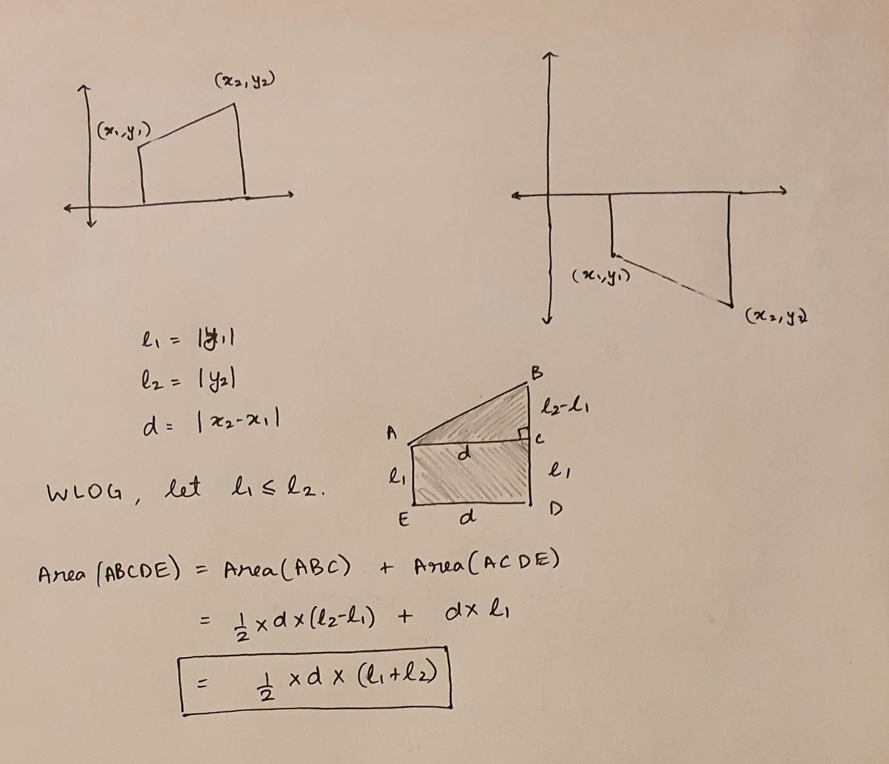
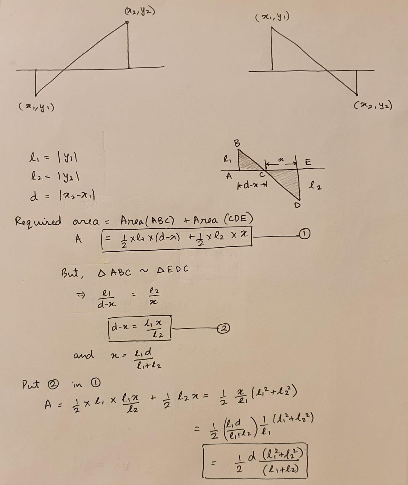
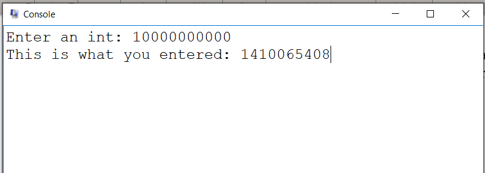

# Area under curve calculator in MIPS

This is a MIPS-based project done to learn about MIPS architectures and how to code using assembly language. This is one of my first assembly language codes.

## Problem Statement:

Write a MIPS Assembly Program for obtaining the area under a curve formed by joining successive points by a straight line.

## Approach:

Considering that the points can be anywhere in the plane, i.e, can have both positive and negative values, there are two major cases that we can observe:

CASE 1: Two adjacent points are on the same side of x axis. (i.e either both have positive y-coordinates, or both have negative y-coordinates)
CASE 2: Two adjacent points are on the opposite sides of the x axis.

Let us solve for the area in these cases ony-by one:
### CASE 1:
As the two points are on the same side, the area between them is int the shape of a trapezium. The area of a trapezium can be calculated very easily. Also, to handle the sub case in which both are on the negative side of the x-axis, I use lengths (instead of coordinates). This makes it easier to understand and therefore, to implement.

   

### CASE 2:
As the two points are on the opposite side of the x-axis, the required area is in the shape of two triangles (mathematically, similar triangles). With use of a bit of elementary geometry, I reach a closed form expression of the area of the figure.
Note that both the lengths should not be zero, if they are, then we will end up dividing by zero.

   

## Design Choices:

1. Input: First the program asks for the number of points that we want to input and then asks for the points. Keeping in mind the convenience of the user, the coordinates of the points have to be put in, one at a time.

2. Not storing all the points: I chose to not store the coordinates of all the points. This decreases the space complexity from O(n) to O(1), without the loss of any important features like checking if the input is in sorted order.

3. Wrong input: I terminate the program whenever some wrong input is received. Wrong input can be like:
a. Input points not sorted.
b. Number of points =< 1

## Notable edge cases (Testing) :

1. Same x-coordinates of adjacent points: When this happens, the trapezium/ two similar triangles essentially collapse into a line and do not add up any value to the answer. No major change in approach (code too) is required. Eg: (1, 1) (3, 4) (3, 7) (5, -9)

2. Negative x-coordinate: Points can be scattered anywhere in the plane, so some can be on the left of y-axis too. No impact on approach or code. Eg: (-50, 5) (2, 4) (5, 9)

3. Overflow: As the points are not bounded, they can have big enough values to overflow. Incorporated an overflow check at each intermediate arithmetic where
overflowing is possible. It tells the user whenever an overflow.
Note: The input values themselves can be bigger than what can be stored in 32-bit registers. So, they will overflow right on being read and there will be no good way to check if the value that got stored was equal to the original value entered by the
user. (One way is to read it as a string convert it to int, and then compare them)

   
  Fig: input value vs what is stored

4. Unsorted input: When input is not sorted, I just output that the input is unsorted and terminate the execution. Eg: (-2, 4) (11, 3) (4, 5) (8, 4)

5. Two adjacent y coordinates are zero: In the derivation of case 2 earlier, it was taken that the lengths are not zero. If they are, we end up dividing by zero. So, I mapped this case to the trapezium case instead of the two-triangles case. Eg: (1, 0) (2, 0) (3, 0)

6. Number of points < 2: I return zero and terminate the execution whenever n < 2.

___
Course Mini Project | COL216: System Architecture | Prof. Preeti Ranjan Panda | Spring 2021-22
